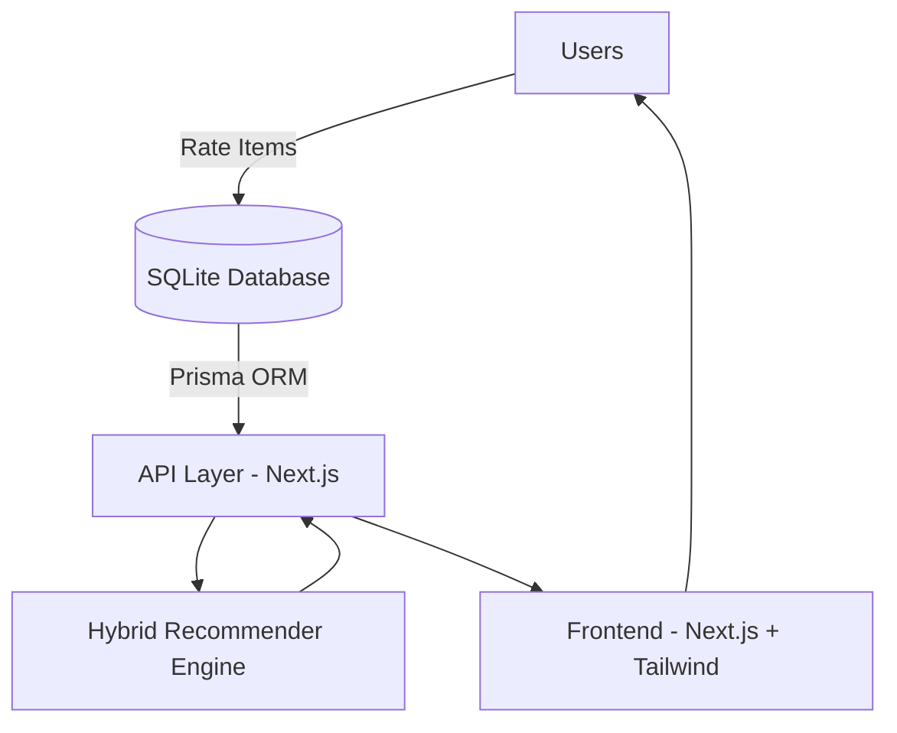

# 🎬 Next.js Hybrid Collaborative Filtering Recommender System

A **collaborative filtering recommendation system** built with **Next.js 15, React 19, Prisma, SQLite, TailwindCSS, and ml-matrix**.  
It combines **matrix factorization (SVD)** and **cosine similarity** to provide personalized recommendations.

This project demonstrates a **full-stack movie recommender system** with:  
- 🗄 Database schema and seeding (Prisma + SQLite)  
- 🧠 Hybrid recommendation algorithm (Matrix Factorization + Cosine Similarity)  
- ⚡ RESTful API endpoints (Next.js App Router)  
- 🎨 Interactive frontend (Next.js + Tailwind + shadcn/ui)  

---

## 🚀 Features

- Collaborative filtering recommendation system
- Matrix Factorization using **Singular Value Decomposition (SVD)**
- Cosine similarity for **item-based collaborative filtering**
- Hybrid scoring (70% MF + 30% similarity boost)
- Prisma ORM with SQLite database
- RESTful APIs for users, items, and recommendations
- Frontend UI to explore recommendations by user

---

## 🛠 Tech Stack

- **Frontend**: [Next.js 15](https://nextjs.org/), [React 19](https://react.dev/), [TailwindCSS 4](https://tailwindcss.com/), [shadcn/ui](https://ui.shadcn.com/), [lucide-react](https://lucide.dev/)  
- **Backend**: [Next.js API Routes](https://nextjs.org/docs/app/building-your-application/routing/router-handlers)  
- **Database**: [SQLite](https://www.sqlite.org/) with [Prisma ORM](https://www.prisma.io/)  
- **ML Libraries**: [ml-matrix](https://github.com/mljs/matrix), [ml-distance](https://github.com/mljs/distance)  

---

## 📂 Project Structure

```
nextjs-recommender-app/
├── prisma/
│   ├── schema.prisma        # Database schema
│   └── seed.ts              # Database seeder
├── src/
│   ├── app/
│   │   ├── api/
│   │   │   ├── users/route.ts         # Fetch all users
│   │   │   ├── items/[id]/route.ts    # Fetch single item
│   │   │   └── recommend/[userId]/    # Get recommendations for user
│   │   └── page.tsx         # Frontend UI
│   └── lib/
│       └── recommend-hybrid.ts # Hybrid recommender algorithm
├── package.json
└── README.md
```

---

## 🗄 Database Schema

Prisma models (`prisma/schema.prisma`):

```prisma
model User {
  id      String   @id @default(cuid())
  name    String
  email   String   @unique
  ratings Rating[]
  @@map("users")
}

model Item {
  id      String   @id @default(cuid())
  title   String
  category String?
  ratings Rating[]
  @@map("items")
}

model Rating {
  id        String   @id @default(cuid())
  userId    String
  itemId    String
  rating    Float
  createdAt DateTime @default(now())

  user User @relation(fields: [userId], references: [id])
  item Item @relation(fields: [itemId], references: [id])
  @@map("ratings")
}
```

---

## 🌱 Seeding the Database

Seed script (`prisma/seed.ts`) creates:

- 10 users
- 20 movies
- Randomized ratings (80% chance per user/movie, score between 1–5)

Run:

```bash
npx prisma migrate dev --name init
npx prisma db seed
```

---

## 🧠 Recommendation Engine

The hybrid recommender (`src/lib/recommend-hybrid.ts`) works by:

1. Building a **user-item rating matrix**
2. Applying **SVD** for **matrix factorization**
3. Computing **cosine similarity** between items
4. Combining both scores (70% MF + 30% similarity boost)
5. Returning **Top-N recommendations**

```typescript
export function recommendHybrid(
  userId: string,
  users: User[],
  items: Item[],
  ratings: Rating[],
  topN = 10
)
```

---

## ⚡ API Endpoints

### 🔹 Get All Users

`GET /api/users`

Response:

```json
{
  "users": [
    { "id": "abc123", "name": "Alice", "email": "alice@example.com" },
    { "id": "def456", "name": "Bob", "email": "bob@example.com" }
  ]
}
```

### 🔹 Get Item by ID

`GET /api/items/[id]`

Response:

```json
{
  "id": "xyz789",
  "title": "Inception",
  "category": "Sci-Fi"
}
```

### 🔹 Get Recommendations for a User

`GET /api/recommend/[userId]`

Response:

```json
{
  "recommendations": [
    { "itemId": "xyz789", "score": 4.87 },
    { "itemId": "lmn456", "score": 4.55 }
  ]
}
```

---

## 🎨 Frontend UI

`src/app/page.tsx` provides:

- Dropdown to select a user
- Fetches recommendations via `/api/recommend/[userId]`
- Displays ranked list of movies in **shadcn/ui Cards**

Example UI:

```
Select User: Alice (alice@example.com)

1. Inception        Score: 4.87
2. Interstellar     Score: 4.55
3. The Dark Knight  Score: 4.20
```

---

## 🛠 Installation & Setup

Clone repo:

```bash
git clone https://github.com/your-username/nextjs-recommender-app.git
cd nextjs-recommender-app
```

Install dependencies:

```bash
npm install
```

Setup Prisma:

```bash
npx prisma generate
npx prisma migrate dev --name init
npx prisma db seed
```

Run app:

```bash
npm run dev
```

Visit: **[http://localhost:3000](http://localhost:3000)**

---

## 🧩 Architecture



---

## 📦 Key Dependencies

- `@prisma/client` → ORM
- `ml-matrix`, `ml-distance` → Recommendation ML
- `next`, `react`, `react-dom` → Frontend & Server
- `tailwindcss`, `lucide-react`, `shadcn/ui` → UI

---

## 📌 Future Improvements

- [ ] Add authentication (e.g. NextAuth.js)
- [ ] Support larger datasets (switch SQLite → PostgreSQL/MySQL)
- [ ] Add caching for recommendations
- [ ] Add evaluation metrics (RMSE, MAE)
- [ ] Implement real-time rating updates
- [ ] Add content-based filtering features
- [ ] Deploy to production (Vercel/Railway)

---

## 👨‍💻 Author

Built by **Edze Worla Alex** ([@edze-worla-alex](https://github.com/edze-worla-alex))  
Co-founder of **Sikanua Diets**

---

## 📜 License

This project is licensed under the **MIT License**.

---

## 🤝 Contributing

1. Fork the repository
2. Create your feature branch (`git checkout -b feature/amazing-feature`)
3. Commit your changes (`git commit -m 'Add some amazing feature'`)
4. Push to the branch (`git push origin feature/amazing-feature`)
5. Open a Pull Request

---

## 📧 Support

For questions or support, please open an issue on GitHub or contact [@softryve](https://github.com/edze-worla-alex).